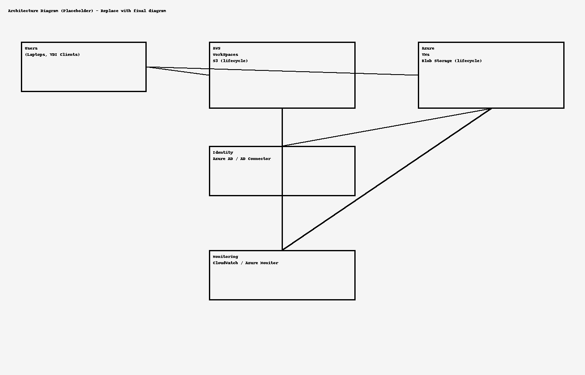

# Multi-Cloud Virtual Workspace Deployment

**Overview**  
This project demonstrates the design and deployment of a **hybrid virtual workspace** using **AWS WorkSpaces** and **Azure Virtual Machines**.  
It was developed for a **small business client** to enable secure remote work, cloud-based development environments, and centralized storage.

---

## Features
- **AWS WorkSpaces** for Windows & Linux desktops
- **Azure Virtual Machines** for testing and staging
- Integrated **on-premises Active Directory** with Azure AD for SSO
- **AWS S3** and **Azure Blob Storage** for redundant file storage
- Lifecycle policies for automated data archiving
- **AWS CloudWatch** & **Azure Monitor** for performance tracking

---

## Architecture Diagram

---

## Technologies Used
- AWS WorkSpaces  
- AWS S3  
- Azure Virtual Machines  
- Azure Blob Storage  
- Active Directory / Azure AD  
- AWS CloudWatch  
- Azure Monitor  

---

## Setup & Configuration
Detailed setup instructions are available in:
- [`/aws/workspace_setup.md`](aws/workspace_setup.md)
- [`/azure/vm_setup.md`](azure/vm_setup.md)

---

## Use Cases
- Remote workforce enablement
- Hybrid cloud application testing
- Secure multi-platform desktop environments

---

## Author
Robert Mezian  
[LinkedIn Profile](https://linkedin.com/in/robert-mezian)
